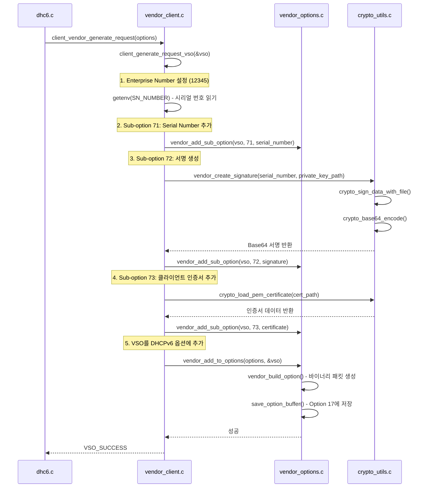
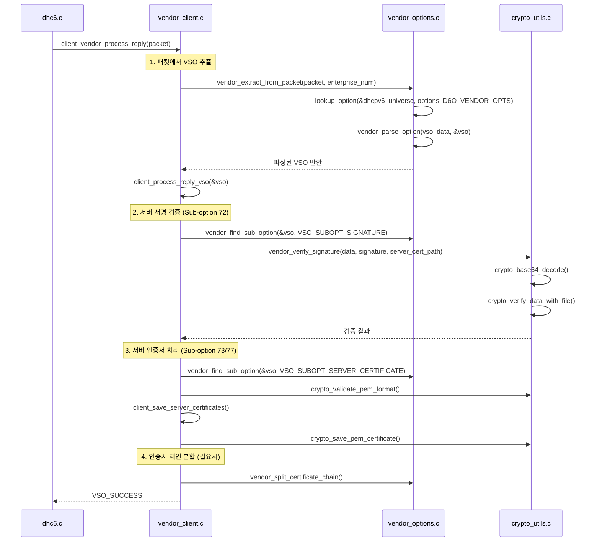

# DHCPv6 클라이언트 Vendor-Specific Options 구현 문서

## 1. 개요

이 문서는 ISC DHCP 4.4.3-P1 DHCPv6 클라이언트에 추가된 Vendor-Specific Options (VSO) 기능의 구현 내용과 호출 흐름을 상세히 설명합니다.

### 1.1 구현 범위
- RFC 3315 Option 17 (Vendor-Specific Information Option) 클라이언트 지원
- OpenSSL 기반 암호화 서명/검증
- 클라이언트 인증서 및 시리얼 번호 처리
- DHCPv6 요청/응답 패킷에서 vendor options 처리

### 1.2 주요 파일
- `client/vendor_client.c` - 클라이언트 vendor 처리 메인 로직
- `client/dhclient.c` - 클라이언트 초기화 및 vendor handler 시작
- `client/dhc6.c` - DHCPv6 패킷 처리 및 vendor options 통합
- `common/vendor_options.c` - 공통 vendor options 라이브러리
- `common/crypto_utils.c` - 암호화 유틸리티

## 2. 아키텍처 구조

```
DHCPv6 Client Architecture with Vendor Options

┌─────────────────────────────────────────────────────────────┐
│                    DHCPv6 Client (dhclient)                │
├─────────────────────────────────────────────────────────────┤
│  main() [dhclient.c]                                       │
│  ├── client_vendor_init()                                  │
│  └── DHCPv6 처리 루프 시작                                   │
├─────────────────────────────────────────────────────────────┤
│  DHCPv6 패킷 처리 [dhc6.c]                                  │
│  ├── Request 생성: client_vendor_generate_request()         │
│  └── Reply 처리: client_vendor_process_reply()              │
├─────────────────────────────────────────────────────────────┤
│  Vendor Client Handler [vendor_client.c]                   │
│  ├── 설정 관리 (client_load_config)                        │
│  ├── VSO 생성 (client_generate_request_vso)                │
│  ├── VSO 처리 (client_process_reply_vso)                   │
│  └── 인증서 관리 (client_save_server_certificates)          │
├─────────────────────────────────────────────────────────────┤
│  Vendor Options Library [vendor_options.c]                 │
│  ├── VSO 파싱/생성 (vendor_parse_option/vendor_build_option)│
│  ├── Sub-option 관리 (vendor_add_sub_option/find)          │
│  └── 패킷 통합 (vendor_extract_from_packet/add_to_options) │
├─────────────────────────────────────────────────────────────┤
│  Crypto Utils [crypto_utils.c]                             │
│  ├── RSA 서명/검증 (crypto_sign_data/verify_data)           │
│  ├── Base64 인코딩/디코딩                                   │
│  └── 인증서 처리 (crypto_load_pem_certificate)              │
└─────────────────────────────────────────────────────────────┘
```

## 3. 클라이언트 초기화 흐름

### 3.1 메인 초기화 (dhclient.c)

```c
// dhclient.c:890-899
#ifdef DHCPv6
if (local_family == AF_INET6) {
    /* Initialize vendor client handler */
    if (client_vendor_init() != 0) {
        log_error("Failed to initialize vendor client handler");
        /* Continue without vendor options */
    } else {
        log_info("Vendor client handler initialized");
    }
}
#endif
```

### 3.2 Vendor Client 초기화 (vendor_client.c)

```c
// vendor_client.c:54-81
int client_vendor_init(void) {
    int result;
    
    if (client_vendor_initialized) {
        return VSO_SUCCESS;
    }
    
    /* Initialize vendor options library */
    result = vendor_options_init();
    if (result != VSO_SUCCESS) {
        log_error("Failed to initialize vendor options library: %s",
                 vendor_get_error_string(result));
        return result;
    }
    
    /* Load client configuration */
    result = client_load_config();
    if (result != VSO_SUCCESS) {
        log_error("Failed to load client vendor configuration");
        return result;
    }
    
    client_vendor_initialized = 1;
    log_info("Client vendor handler initialized for enterprise %u",
             client_config.enterprise_num);
    
    return VSO_SUCCESS;
}
```

### 3.3 클라이언트 설정 로드

```c
// vendor_client.c:118-150
static int client_load_config(void) {
    /* Initialize default configuration */
    memset(&client_config, 0, sizeof(client_config));
    
    /* Default enterprise number */
    client_config.enterprise_num = 12345;
    client_config.enabled = 1;
    client_config.verify_signature = 1;
    
    /* Environment variable for serial number */
    client_config.serial_number_env = "SN_NUMBER";
    
    /* Default certificate paths */
    strcpy(client_config.private_key_path, "/etc/dhcp/vendor_private.key");
    strcpy(client_config.request_certificate_path, "/etc/dhcp/vendor_client.pem");
    strcpy(client_config.server_cert_save_path, "/var/lib/dhcp/vendor_server_certs");
    
    return VSO_SUCCESS;
}
```

## 4. DHCPv6 Request 생성 Call Flow

### 4.1 Request 생성 시점 (dhc6.c)

DHCPv6 요청 패킷을 생성할 때 vendor options를 추가하는 지점:

```c
// dhc6.c:5873-5880 (make_request6 함수 내)
/* Generate vendor-specific options if enabled */
if (client_vendor_enabled()) {
    int vso_result = client_vendor_generate_request(*op);
    if (vso_result != 0) {
        log_debug("Failed to generate vendor options: error %d", vso_result);
        /* Continue without vendor options */
    }
}
```

### 4.2 Vendor Request 생성 상세 흐름



### 4.3 생성되는 Vendor Option 구조

```
DHCPv6 Vendor-Specific Information Option (Option 17)
┌────────────────────────────────────────────────────────────┐
│ Option Code: 17 (OPTION_VENDOR_OPTS)                      │
├────────────────────────────────────────────────────────────┤
│ Option Length: Variable                                    │
├────────────────────────────────────────────────────────────┤
│ Enterprise Number: 12345 (4 bytes, network byte order)    │
├────────────────────────────────────────────────────────────┤
│ Sub-option 71: Serial Number                              │
│ ├── Code: 71 (2 bytes)                                    │
│ ├── Length: Variable (2 bytes)                            │
│ └── Data: Serial Number String                            │
├────────────────────────────────────────────────────────────┤
│ Sub-option 72: RSA-SHA256 Signature                       │
│ ├── Code: 72 (2 bytes)                                    │
│ ├── Length: Variable (2 bytes)                            │
│ └── Data: Base64 Encoded Signature                        │
├────────────────────────────────────────────────────────────┤
│ Sub-option 73: Client Certificate                         │
│ ├── Code: 73 (2 bytes)                                    │
│ ├── Length: Variable (2 bytes)                            │
│ └── Data: PEM Format Certificate                          │
└────────────────────────────────────────────────────────────┘
```

## 5. DHCPv6 Reply 처리 Call Flow

### 5.1 Reply 처리 시점 (dhc6.c)

DHCPv6 응답 패킷을 받았을 때 vendor options를 처리하는 지점:

```c
// dhc6.c:707-714 (dhc6_check_reply 함수 내)
/* Process vendor-specific options if present */
if (client_vendor_enabled()) {
    int vso_result = client_vendor_process_reply(packet);
    if (vso_result != 0) {
        log_debug("Failed to process vendor options from reply: error %d", vso_result);
        /* Continue normal processing even if VSO processing fails */
    }
}
```

### 5.2 Vendor Reply 처리 상세 흐름



## 6. 주요 데이터 구조

### 6.1 클라이언트 설정 구조체

```c
// vendor_client.c:26-42
struct client_vendor_config {
    uint32_t enterprise_num;              // Enterprise Number
    int enabled;                          // Vendor options 활성화 여부
    int verify_signature;                 // 서명 검증 활성화 여부
    char *serial_number_env;              // 시리얼 번호 환경변수명
    char private_key_path[256];           // 클라이언트 개인키 경로
    char request_certificate_path[256];   // 클라이언트 인증서 경로
    char server_cert_save_path[256];      // 서버 인증서 저장 경로
    char server_ca_cert_path[256];        // 서버 CA 인증서 경로
};
```

### 6.2 Vendor Option 구조체 (vendor_options.h)

```c
// vendor_options.h
struct vendor_sub_option {
    uint16_t code;                        // Sub-option code
    uint16_t length;                      // Sub-option data length
    unsigned char *data;                  // Sub-option data
};

struct vendor_option {
    uint32_t enterprise_num;              // Enterprise Number
    int sub_option_count;                 // Number of sub-options
    struct vendor_sub_option sub_options[VSO_MAX_SUB_OPTIONS];
};
```

## 7. Sub-Option 코드 정의

### 7.1 클라이언트 Request Sub-Options

| 코드 | 이름 | 설명 | 데이터 형식 |
|------|------|------|-------------|
| 71 | VSO_SUBOPT_SERIAL_NUMBER | 클라이언트 시리얼 번호 | ASCII 문자열 |
| 72 | VSO_SUBOPT_SIGNATURE | RSA-SHA256 서명 | Base64 인코딩 |
| 73 | VSO_SUBOPT_CLIENT_CERTIFICATE | 클라이언트 인증서 | PEM 형식 |

### 7.2 서버 Reply Sub-Options

| 코드 | 이름 | 설명 | 데이터 형식 |
|------|------|------|-------------|
| 72 | VSO_SUBOPT_SIGNATURE | 서버 응답 서명 | Base64 인코딩 |
| 73 | VSO_SUBOPT_SERVER_CERTIFICATE | 서버 인증서 | PEM 형식 |
| 77 | VSO_SUBOPT_CERTIFICATE_CHAIN | 인증서 체인 | PEM 형식 (연결) |

## 8. 에러 처리 및 로깅

### 8.1 에러 코드 정의

```c
// vendor_options.h
#define VSO_SUCCESS             0
#define VSO_ERROR              -1
#define VSO_INVALID_DATA       -2
#define VSO_BUFFER_TOO_SMALL   -3
#define VSO_NOT_FOUND          -4
#define VSO_CRYPTO_ERROR       -5
```

### 8.2 로깅 예시

```
클라이언트 시작 시:
INFO: Client vendor handler initialized for enterprise 12345

Request 생성 시:
INFO: Using serial number: ABC12345... (16 chars)
DEBUG: Added sub-option 71: 16 bytes
DEBUG: Added sub-option 72: 344 bytes  
DEBUG: Added sub-option 73: 1205 bytes
INFO: Built VSO with 3 sub-options for enterprise 12345 (1582 bytes)

Reply 처리 시:
INFO: Parsed VSO with 2 sub-options for enterprise 12345
INFO: Server signature verification: PASSED
INFO: Server certificate saved to /var/lib/dhcp/vendor_server_certs/server_12345.pem
```

## 9. 설정 및 배포

### 9.1 필요한 파일들

1. **클라이언트 개인키**: `/etc/dhcp/vendor_private.key` (권한: 0600)
2. **클라이언트 인증서**: `/etc/dhcp/vendor_client.pem` (권한: 0644)
3. **서버 CA 인증서**: `/etc/dhcp/vendor_ca.pem` (권한: 0644)

### 9.2 환경변수 설정

```bash
# 시리얼 번호 환경변수 설정
export SN_NUMBER="ABC123456789DEF0"
```

### 9.3 클라이언트 실행

```bash
# DHCPv6 클라이언트 실행 (vendor options 활성화됨)
sudo dhclient -6 -d eth0
```

## 10. 보안 고려사항

### 10.1 개인키 보안
- 개인키 파일 권한: 0600 (소유자만 읽기/쓰기)
- 메모리에서 키 데이터 안전 소거 (`crypto_secure_memzero`)

### 10.2 서명 검증
- RSA-SHA256 알고리즘 사용
- 서버 인증서 체인 검증
- 만료된 인증서 거부

### 10.3 데이터 무결성
- 모든 VSO 데이터 길이 검증
- 버퍼 오버플로우 방지
- 잘못된 형식 패킷 거부

## 11. 성능 최적화

### 11.1 메모리 관리
- 동적 메모리 할당 최소화
- 사용 후 즉시 해제 (`vendor_option_cleanup`)
- 메모리 누수 방지

### 11.2 암호화 성능
- RSA 키 캐싱 (재사용)
- Base64 인코딩 최적화
- 불필요한 인증서 로드 방지

## 12. 문제 해결

### 12.1 일반적인 문제들

| 문제 | 원인 | 해결방법 |
|------|------|----------|
| Vendor options 비활성화 | `client_vendor_init()` 실패 | 로그 확인, 인증서 경로 점검 |
| 시리얼 번호 없음 | 환경변수 미설정 | `export SN_NUMBER=...` |
| 서명 실패 | 개인키 파일 문제 | 키 파일 권한 및 형식 확인 |
| 인증서 검증 실패 | 만료/잘못된 인증서 | 인증서 갱신 |

### 12.2 디버깅 명령

```bash
# 상세 로깅으로 클라이언트 실행
sudo dhclient -6 -d -v eth0

# vendor options 패킷 덤프
sudo tcpdump -i eth0 -v udp port 546 or port 547
```

---

**문서 버전**: 1.0  
**작성일**: 2025-08-17  
**대상 버전**: ISC DHCP 4.4.3-P1  
**작성자**: Claude Code Implementation Team